<div align="center">


# GlucoseGoose 

**Real-time CGM diabetes management**

[](https://reactnative.dev/)
[](https://www.typescriptlang.org/)
[](https://firebase.google.com/)
[](https://expo.dev/)
[](https://deepmind.google/technologies/gemini/)

</div>


## Overview

GlucoseGoose connects to a [Nightscout](https://nightscout.github.io/) CGM server to display real-time glucose readings, log meals and activities, analyze long-term trends, and send smart glucose alerts. Built as a personal project for real daily use.

## Features

**Real-time Glucose Monitoring**
- Live SGV readings with color-coded range indicators and trend arrows
- Custom SVG glucose chart with scrollable time windows (2h / 12h / 24h)
- Event overlays on the chart: meals, activities, insulin — tap any to see details
- Smart alerts: low, high, urgent low, rapid drop, stale data, back-in-range
- Persistent live status notification showing current glucose
- Optional goose sound alert mode 🪿

**Meal Logging**
- Log meals by type (Breakfast, Lunch, Dinner, Snacks) with time picker
- AI-powered meal photo analysis via Google Gemini — photograph food, get per-item nutrition breakdown (calories, carbs, protein, fat, fiber) with confidence rating
- Manual nutrition entry as fallback
- Posts all meals to Nightscout as treatments

**Activity Logging**
- 10 activity types with MET-based calorie estimation
- Intensity multipliers (Low / Medium / High) with full calculation breakdown shown before saving
- Posts to Nightscout as activity treatments

**Trends & Analytics**
- Long-term analysis: 7 / 14 / 30 / 90 days or custom date range
- Key metrics: average glucose, time-in-range %, HbA1c estimate, hypo event count, standard deviation
- Daily average chart and 24-hour hourly pattern chart
- TTL-based local analysis cache

**Health Connect (Android)**
- Syncs steps, heart rate, calories, exercise sessions, and nutrition from Health Connect
- Auto-sync mode runs in the background
- Posts synced data directly to Nightscout

**Profile & Alerts**
- Fully configurable glucose thresholds, cooldown periods, and sound modes
- User profile with weight, height, age, gender (used for calorie calculations)
- Goose avatar picker 🪿

---

## Screenshots
<!-- Row 1: Login, Home, Food Modal -->
<div align="center">
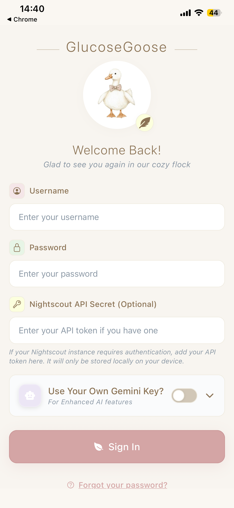
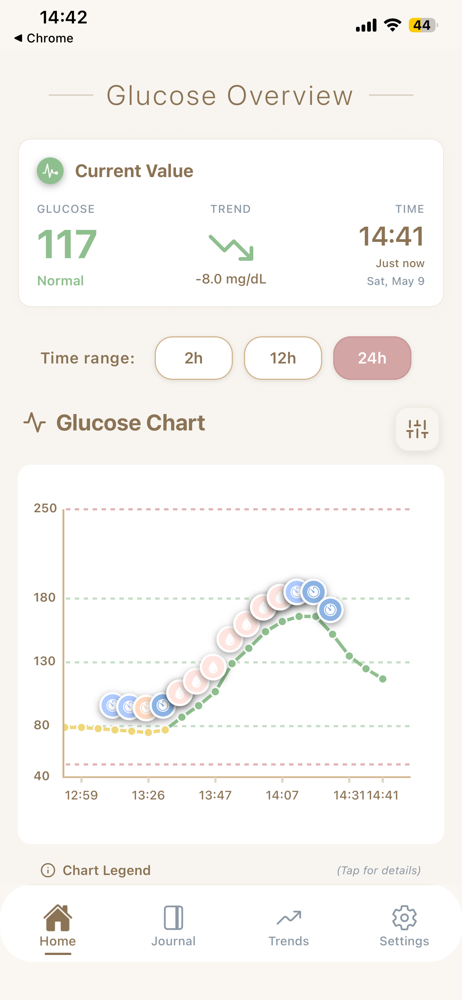
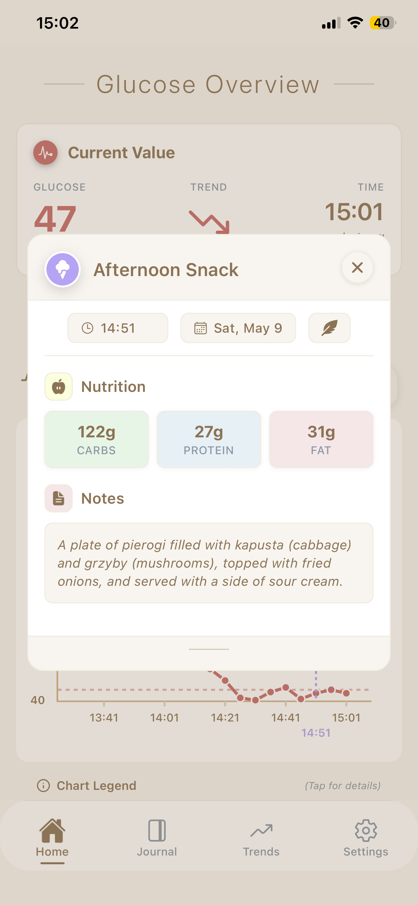
  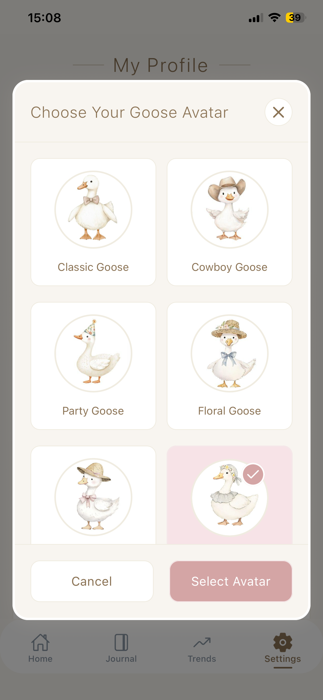

</div>

<!-- Row 2: Journal charts -->
<div align="center">
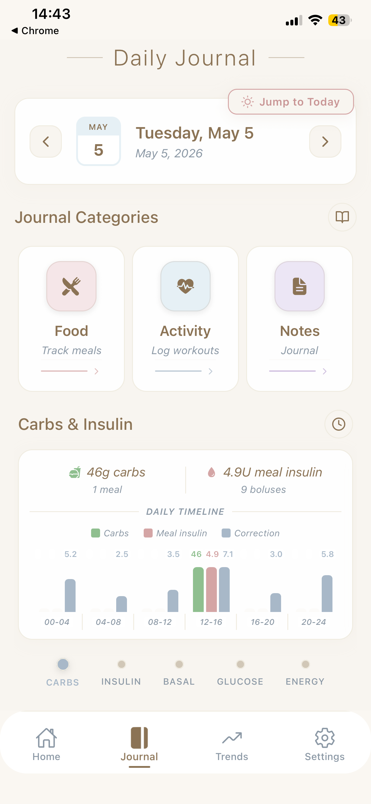
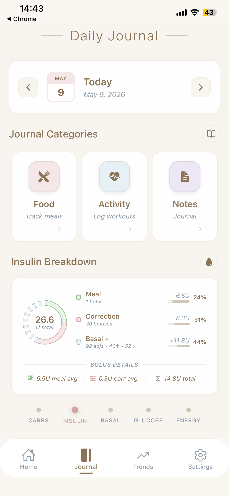
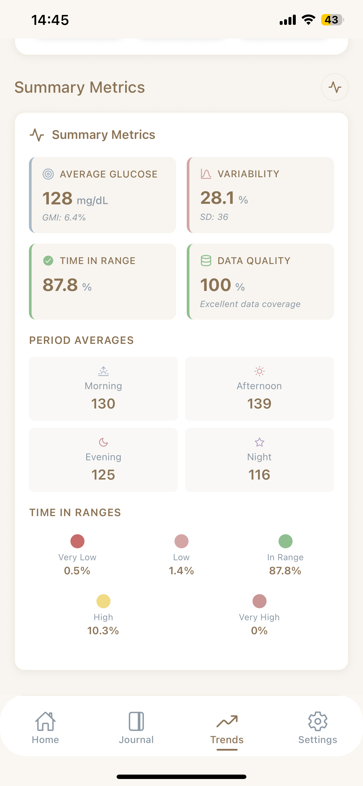
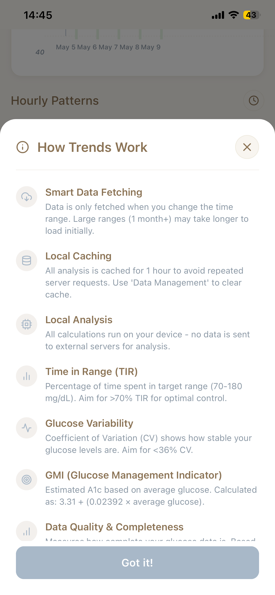
</div>

<!-- Row 3: Meals -->
<div align="center">
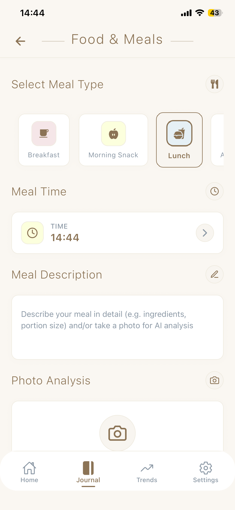
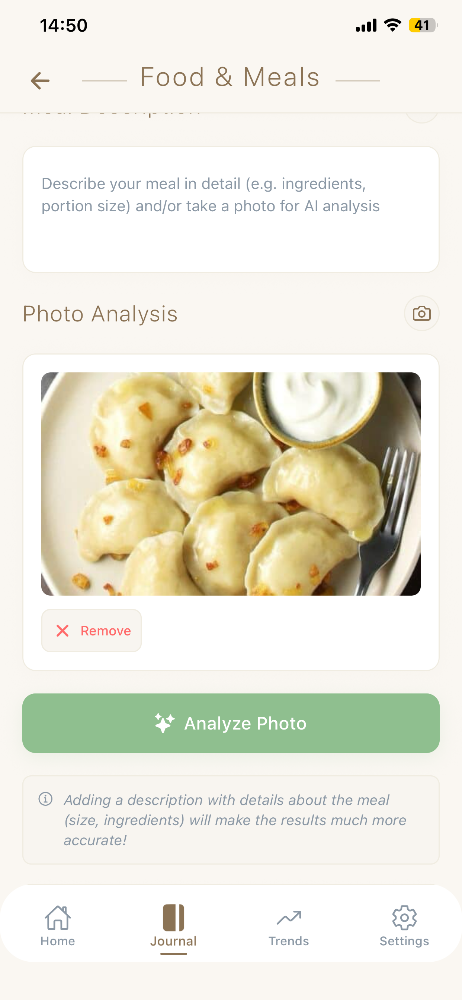
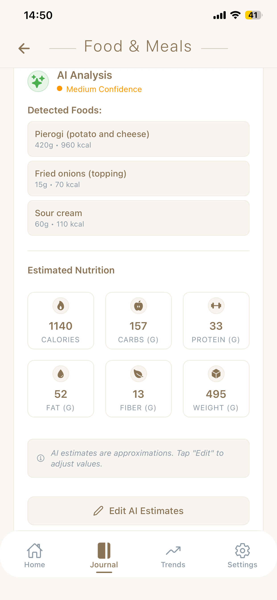
  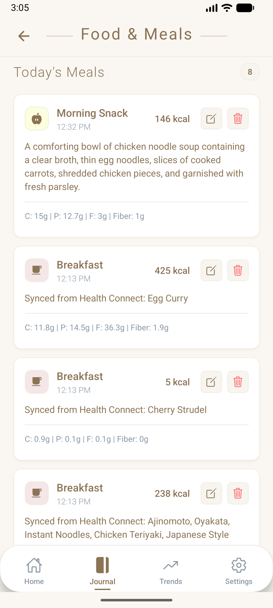

</div>

<!-- Row 5: Notification (full width, landscape) -->
<div align="center">
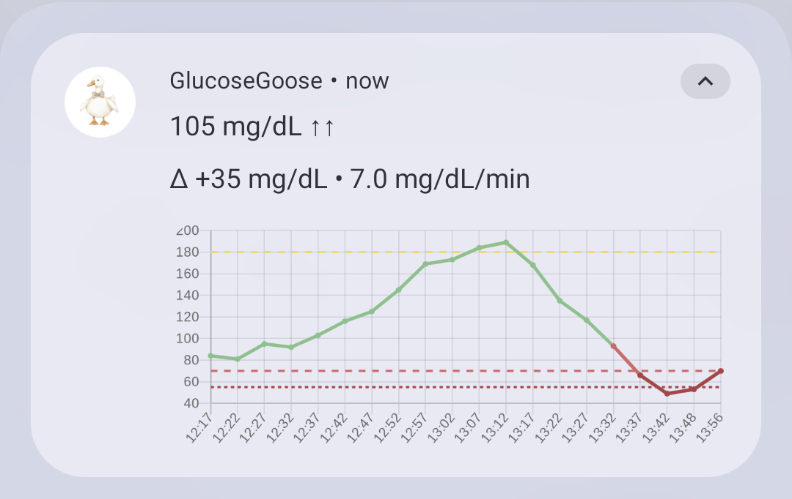
</div>

[See all screenshots](docs/screenshots/)


## Architecture

The app follows a C4 architecture model documented in [`docs/architecture/`](docs/architecture/).

<div align="center">

| System Context | Container Diagram |
|:--------------:|:-----------------:|
| 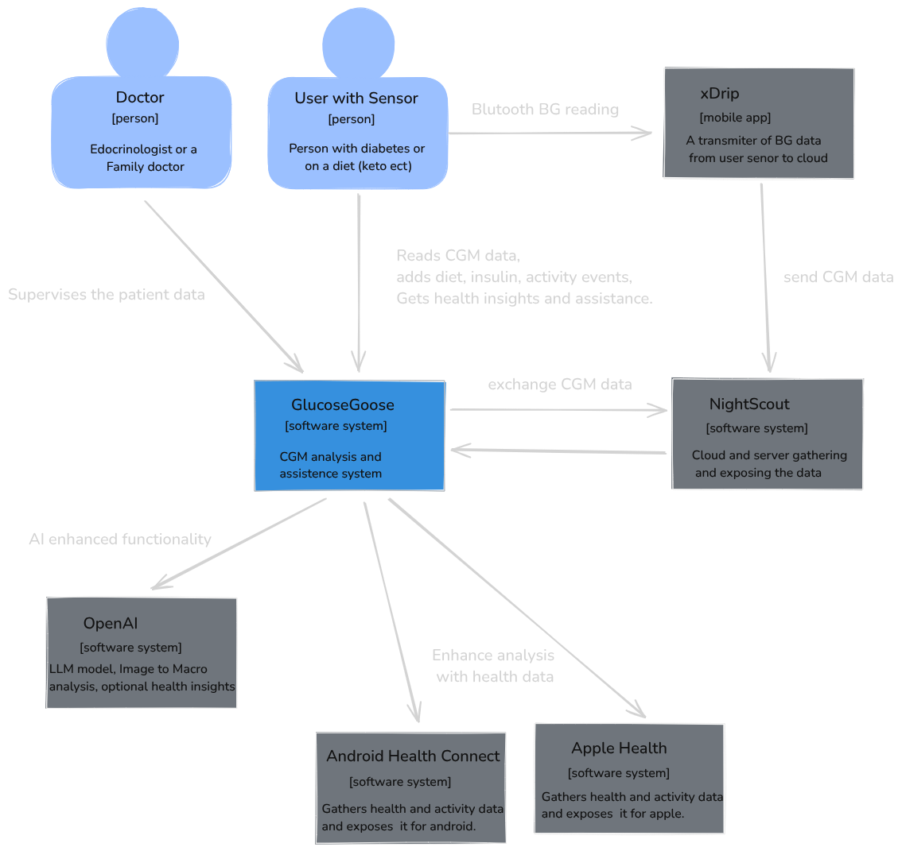 | 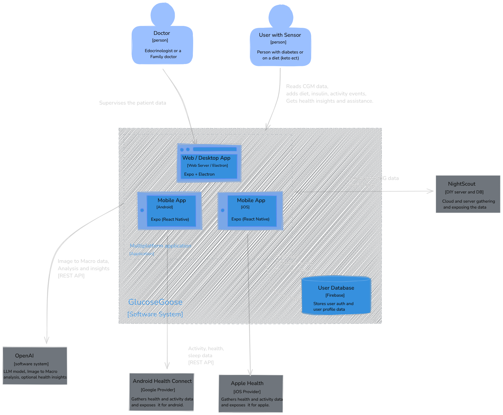 |

</div>

| Data | Storage |
|------|---------|
| User profile, alerts config | Firebase Firestore |
| Auth session | Firebase Authentication |
| Glucose readings | Nightscout REST API |
| Treatments (meals, activities, notes) | Nightscout REST API |
| Nightscout API secret | expo-secure-store |
| Gemini API key | expo-secure-store |
| Trends analysis cache | AsyncStorage (TTL-based) |


## Tech Stack

| Layer | Technology |
|-------|-----------|
| Framework | React Native 0.81.5, Expo ~54 |
| Language | TypeScript |
| Auth & Database | Firebase (Auth + Firestore) |
| CGM Data | Nightscout REST API |
| AI | Google Gemini via Firebase Cloud Functions |
| Health Data | Google Health Connect (Android) |
| Charts | react-native-svg |
| Notifications | expo-notifications |
| Secure Storage | expo-secure-store |


## Setup

```bash
git clone https://github.com/wlaszkiewicz/GlucoseGoose.git
cd GlucoseGoose
npm install
npx expo start
```

**Requirements:**
- A running [Nightscout](https://nightscout.github.io/) instance
- Firebase project with Auth and Firestore enabled
- Google Gemini API key for AI meal analysis (optional — can be entered at login or configured server-side)


## Known Limitations

- Mood, Medication, and Sleep logging are planned but not yet implemented
- Health Connect integration is Android only
- Web/desktop platform support are present in the codebase but not actively maintained
